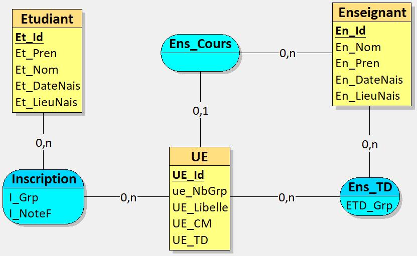
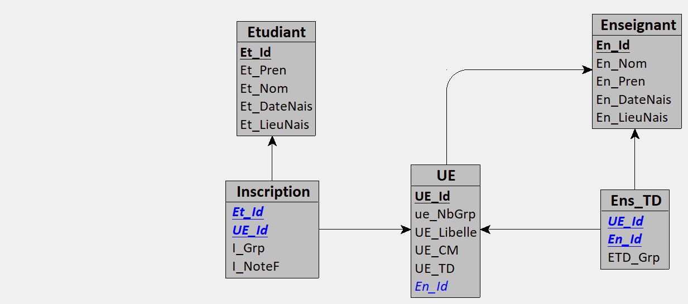

# TD Optimisation Algébrique

## Schéma Relationnel

On considère le schéma relationnel suivant :

**ÉTUDIANT**(Et_Id, Et_Nom, Et_Pren, Et_DateNais, Et_LieuNais)  
**ENSEIGNANT**(En_Id, En_Nom, En_Pren, En_DateNais, En_LieuNais)  
**UE**(UE_Id, UE_Libelle, UE_CM, UE_TD, UE_NbGrp, En_Id)  
**ENS_TD**(UE_Id, En_Id, ETD_Grp)  
**INSCRIPTION**(Et_Id, UE_Id, I_Grp, I_NoteF)

- Les clés primaires sont en **gras**.
- Les clés étrangères sont **soulignées**.

> UE signifie « Unité d’Enseignement ».  
> Tous les attributs sont des chaînes de caractères, sauf :
> - `UE_CM`, `UE_TD`, `UE_NbGrp`, `ETD_Grp` et `I_Grp` : entiers.

---

## Rappel Exercice 1 : Représentation Entité/Association

### Schéma Entité/Association (E/A)



### Description des entités et associations

1. **Entités** :
    - **ÉTUDIANT**: Et_Id, Et_Nom, Et_Pren, Et_DateNais, Et_LieuNais
    - **ENSEIGNANT**: En_Id, En_Nom, En_Pren, En_DateNais, En_LieuNais
    - **UE** : UE_Id, UE_Libelle, UE_CM, UE_TD, UE_NbGrp, En_Id

2. **Associations** :
    - **INSCRIPTION** entre ÉTUDIANT et UE : relie un étudiant à l’UE où il est inscrit (attributs : I_Grp, I_NoteF)
    - **ENS_TD** entre ENSEIGNANT et UE : relie un enseignant à un groupe de TD (attribut : ETD_Grp)
    - L’enseignant principal de l’UE est indiqué par l’attribut `En_Id` d'**UE**.

---

## Modèle Logique de Données (MLD)



### Remarques

- Le MLD montre le schéma relationnel transformé depuis le modèle E/A.
- Les relations deviennent des tables avec leurs clés primaires et étrangères.
- Chaque association avec attributs devient une table à part (ex. INSCRIPTION et ENS_TD).  

## Rappel Exercice 2

### Contexte

Donnez la forme SQL et la forme algébrique des requêtes suivantes (sous forme linéaire et arborescente) :

a. Quels sont les noms des étudiants qui ne suivent aucune UE ?  
b. Quels sont les noms des enseignants qui enseignent la même matière en TD et en Cours ?

### Symboles utilisés

Pour les formes algébriques relationnelles, on utilise les symboles suivants :

- π = projection
- σ = sélection
- ⨝ = jointure naturelle
- ∪ = union
- ∩ = intersection
- − = différence


### Forme SQL (Version NOT EXISTS)

```sql

SELECT Et_Nom
FROM ETUDIANT e
WHERE NOT EXISTS (
    SELECT *
    FROM INSCRIPTION i
    WHERE e.Et_Id = i.Et_Id
);

```
### Forme SQL (version NOT IN)

```sql

SELECT Et_Nom
FROM ÉTUDIANT
WHERE Et_Id NOT IN (
    SELECT Et_Id
    FROM INSCRIPTION
);

```

### Forme algébrique linéaire

π Et_Nom ( Etudiant ⨝ ( π_Et_Id(Etudiant) − π_Et_Id(Inscription) ) )

### Forme algébrique arborescente

#### a) Étudiants qui ne suivent aucune UE

           π(EtNom)
               │
              ⨝
           ┌───┴────────────┐
           │                │
        ÉTUDIANT          ( − )
                       ┌────┴─────┐
                    π(EtId)      π(EtId)
                 (ÉTUDIANT)   (INSCRIPTION)
